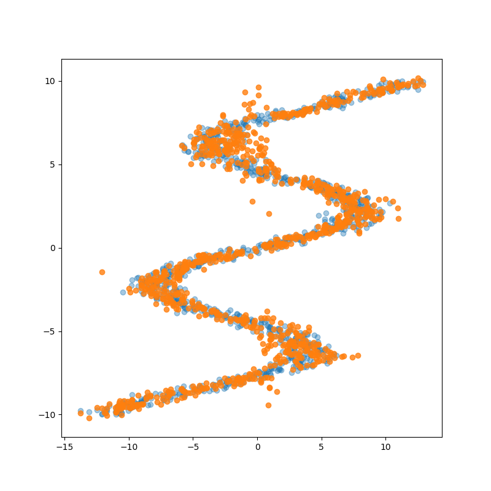

# Mixture Density Network in Pytorch

MDN uses a learned NN to approximate the parameters of a mixture of gaussians that will best fit the data.

Blue - ground truth

Orange - approximated by the model