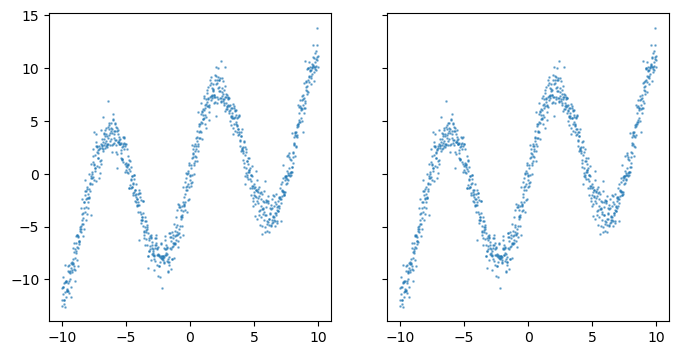

# Mixture Density Network in Pytorch

MDN uses a learned NN and Maximum Likelyhood Estimation (MLE) to approximate the parameters of a mixture of gaussians that will best fit the data.

Source code for my [post on medium](https://medium.com/@duanenielsen/deep-learning-cage-match-multi-layer-nn-vs-mixture-density-network-75f7b38c29bb)

Left: orange: 3 layer NN with 20 hidden neurons blue: ground truth

Right: orange: 2 layer Mixture Density Network with 10 hidden neurons and 5 gaussians.  blue: ground truth

NN was optimized using MSE loss and Adam lr=1e-3, trained for 130 epochs

MDN was optimized using MLE loss and Adam lr=1e-3, trained for 10,000 epochs

Note that NN was also tested for 10,0000 epochs, but this made no material difference to the outcome.